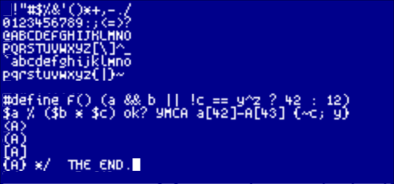

# Spleentt

While considering a project with a 320 x 128 LCD, I needed the
smallest possible readable font that would work here.  The best two
candidates I found where Spleen (5x8) and Creep/Creep2 (5x9).  Each
had their own strenghts and issues, so I decided to create a new font,
mostly based on Spleen.

One of the compromises all the 5 pixel wide font makes is occasionally
spilling into the 5th column, breaking the horizontal spacing.  We'd
want to minimize that.

Changes to original Spleen:

 * The upper case `Y` looked exactly like lowercase `y`, changed to a
   completely different shape that unfortunately spills into the 5th
   column.

 * `$` changed shape and was slanted to stay in 4 columns.

 * `&` was changed to a share inspired more from Creep

 * `,` and `;` were shunk (again, more like Creep).

 * `?`, `/`, `|`, `\`, `(`, `{`, `[`, `]`, `}`, and `)` made a pixel
   shorter to avoid overflowing into the margin (spacing is critical
   to readability).  This further enabled `{` and `}` to look more
   "curly".

 * `<` and `>` were much too big and round before.  Shrunk them and
   made the sharper.

 * `}`, `)`, and `]` were shifted leftwise one pixel to better balance the
   whitespace of enclosed text.  Unfortunately I couldn't do this for `>`
   as it would make it assymetrical when used as the relational operator.

 * `r`, `E`, `F`, and `L` had a curiously round appearence.  Sharped
   up and aligned the `F` fins with the `E`.

 * The `^` felt overweight.  Shunk it.

 * Finally, the `~` overflowed needlessly.  Use a Creep inspired shape.

## Before and after

 font, with code snippets")

## Space Violators

ASCII overflowing vertically: `!`, `"`, `$`, `%`, `&`, `'`, `` ` ``,
`b`, `d`, `f`, `h`, `k`, `l`, `t`

ASCII overflowing horizontally: `#`, `&`, `+`, `T`, `Y`

Fonts are notoriously subjective so I don't expect everyone to agree
with all my compromises.  One particularily thorny character I went
back and forth on is the asterisk `*`.  It feels a bit overweight, but
Creeps' version no longer feels like an asterisk.  Similar story for
the percent `%`.

# Acknowledgments

This wouldn't have been possible without the amazing work of Romeo Van
Snick and Frederic Cambus

* Spleen: https://github.com/fcambus/spleen
* Creep: https://github.com/romeovs/creep

See also https://github.com/toitware/toit-font-clock for _even_ tinier
fonts (I didn't even think that was possible).
